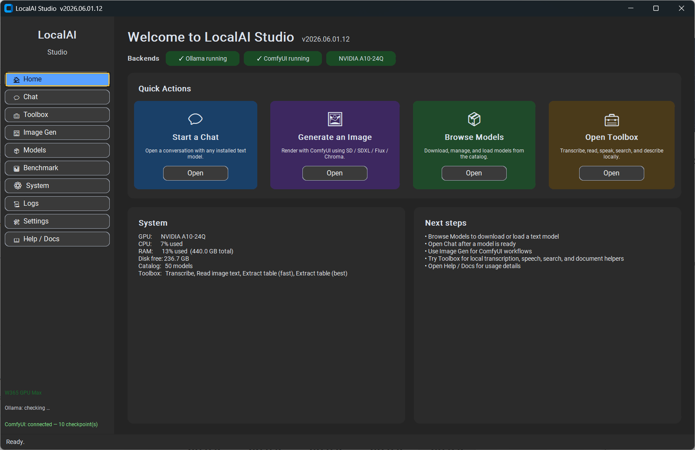
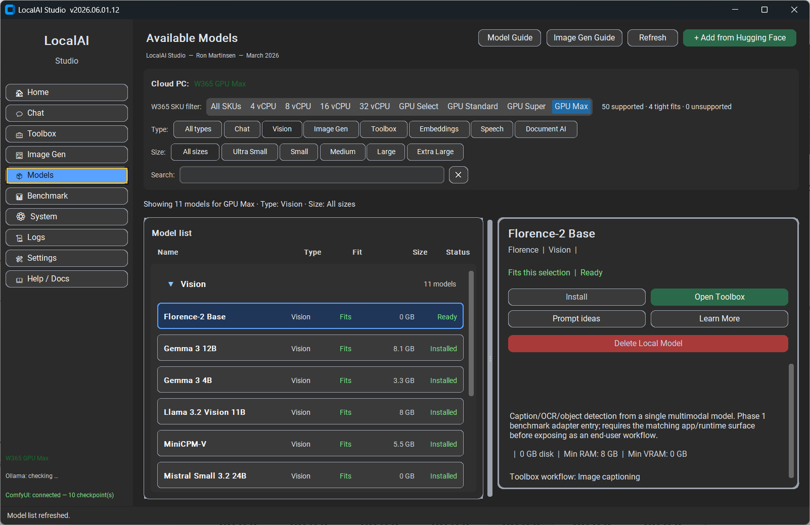
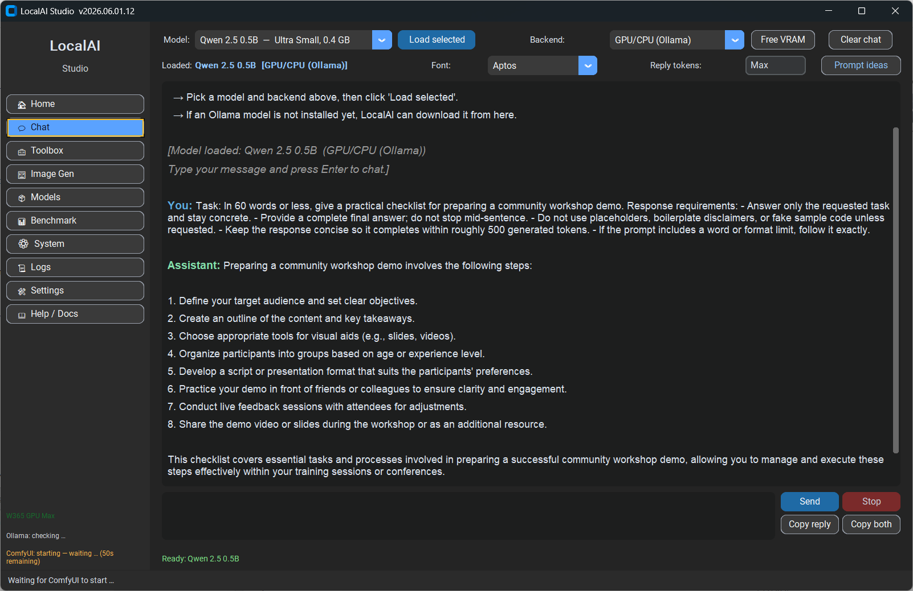
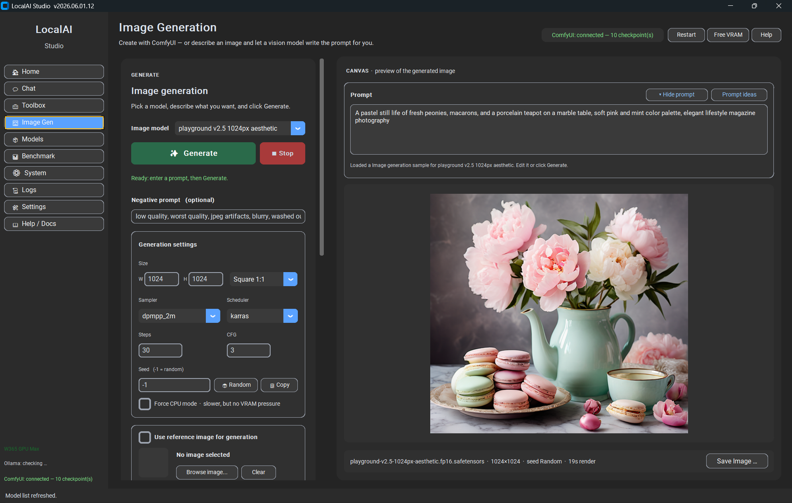
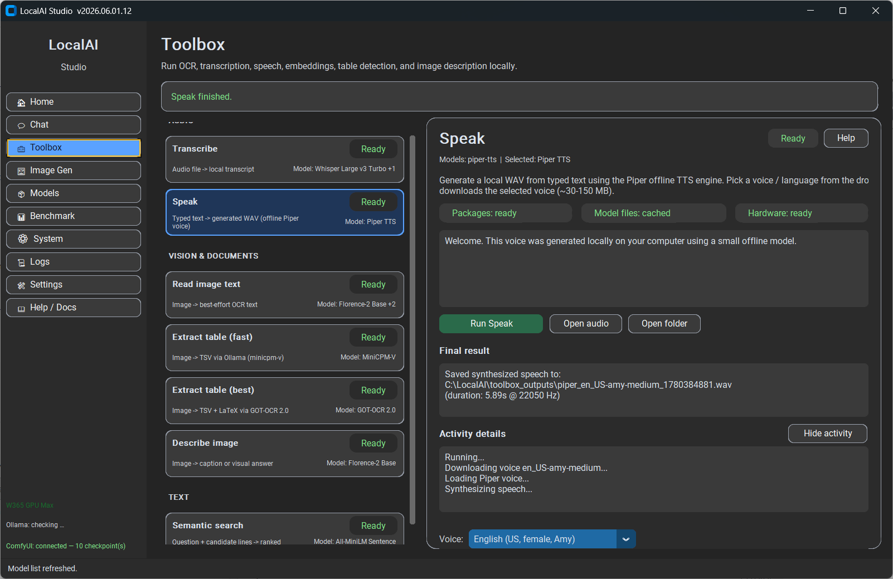
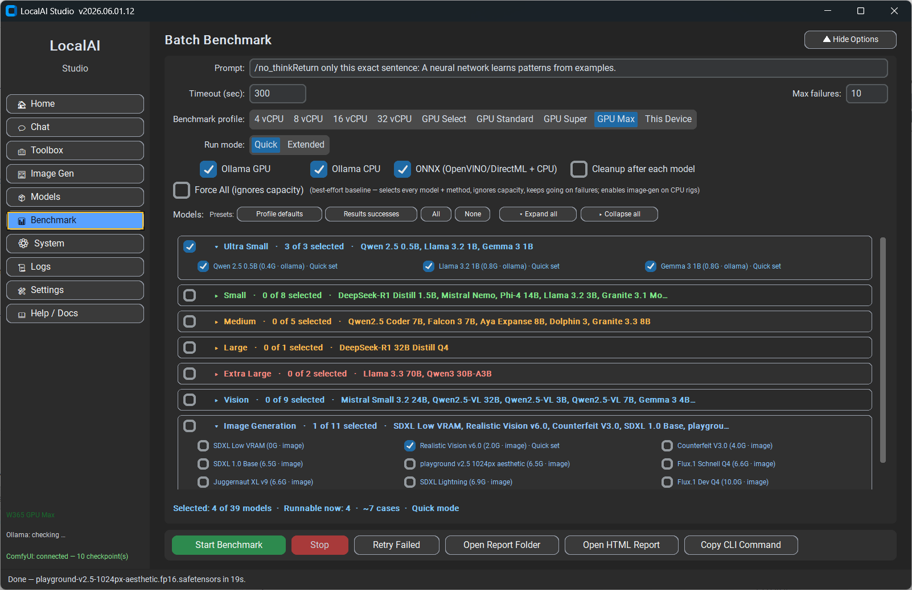
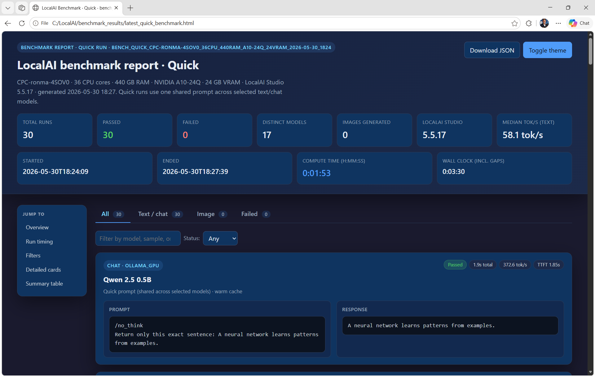
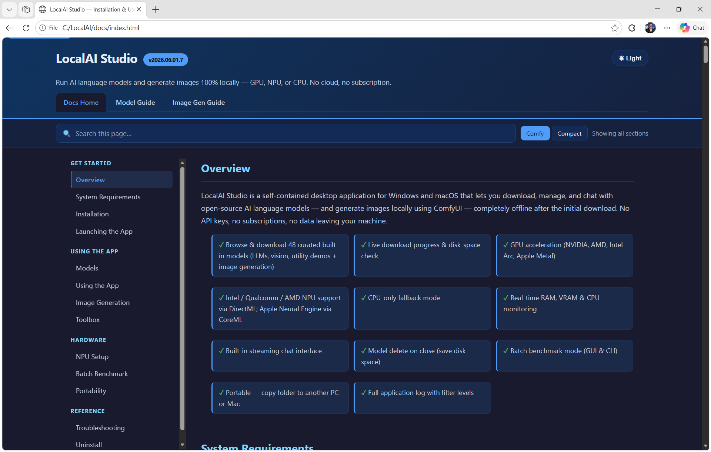
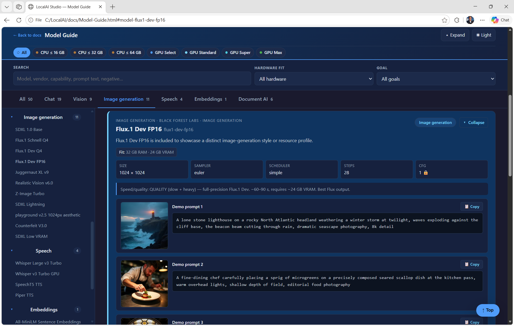
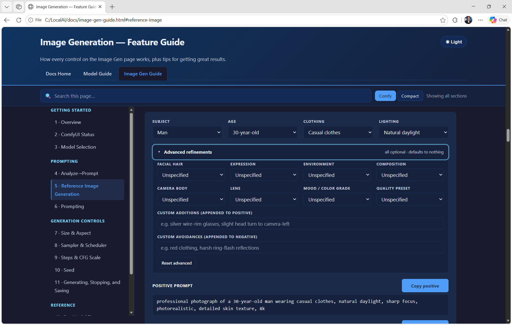

# LocalAI Studio

> ## ⚠️ Personal hobby project — not a product
>
> **This is a personal project by Ron Martinsen, shared publicly for
> entertainment and experimentation.** It is **not** affiliated with,
> endorsed by, supported by, or warranted by his employer or any other
> organization. It is **not** part of any commercial product, service,
> roadmap, or support agreement. Provided **AS-IS**, **no warranty**,
> use entirely at your own risk.
>
> **Read [DISCLAIMER.md](DISCLAIMER.md) before using or referencing
> this project.** In particular, do **not** cite this project as
> evidence that any vendor "supports" a configuration you observe
> working here.

---

## What it is

LocalAI Studio is a single-process desktop GUI that lets you explore
several local AI runtimes side-by-side on a single Windows machine,
without sending data to a cloud service. It orchestrates four
backends:

| Backend | What it runs |
|---|---|
| [Ollama](https://ollama.com/) | Local text and vision LLMs over a streaming REST API. |
| [ComfyUI](https://github.com/comfyanonymous/ComfyUI) | Image generation (Stable Diffusion / SDXL / FLUX family) over REST + WebSocket. |
| [ONNX Runtime](https://onnxruntime.ai/) | In-process inference using DirectML on Windows. |
| [OpenVINO GenAI](https://github.com/openvinotoolkit/openvino.genai) | In-process inference on Intel NPU / GPU / CPU (Windows only). |

Around those it adds a benchmark runner, a model catalog, a chat
interface, an image-generation playground, and a Toolbox tab for
transcribe / OCR / read-tables / TTS / search / describe workflows.

## What it isn't

See [DISCLAIMER.md](DISCLAIMER.md). The short version: it is **not** a
product, **not** affiliated with any vendor, and **not** a substitute for
official vendor support or guidance.

## Screenshots

A quick tour of what LocalAI Studio looks like in use.

| | |
|---|---|
|  | **Home** — landing page with live backend status (Ollama, ComfyUI, ONNX, OpenVINO). |
|  | **Models** — browse the local model catalog, filter by category, install with one click. |
|  | **Chat** — streaming responses from any installed Ollama / ONNX / OpenVINO model. |
|  | **Image Generation** — Stable Diffusion / SDXL / FLUX via ComfyUI, all local. |
|  | **Toolbox** — offline workflows for transcribe, OCR, tables, speech, embeddings, and image description. |
|  | **Benchmark** — pick models, run side-by-side, get TTFT / throughput / RAM / VRAM numbers. |
|  | **Benchmark report** — every run generates a standalone HTML report you can open in any browser. |
|  | **Docs** — built-in offline docs covering setup, models, image gen, and architecture. |
|  | **Model Guide** — per-model demo gallery, prompts, and notes. |
|  | **Image Gen Guide** — tips for prompts, refinements, and getting the most out of each base model. |

## Quick start

### Windows

```cmd
git clone https://github.com/<owner>/localai.git
cd localai
setup.bat
run.bat
```

> 💡 **Setup is auto-logged.** Double-clicking `setup.bat` runs the
> installer inside a PowerShell transcript that captures everything to
> `setup.log` next to the script and pauses at the end — so if anything
> goes wrong you have a complete record to share instead of a console
> window that closed too fast to read. No extra steps required.

The first-run setup detects your hardware (CPU only, NVIDIA GPU, or
AMD/Intel GPU) and installs an appropriate PyTorch wheel + ComfyUI
alongside the app. See [docs/architecture.md](docs/architecture.md)
for the longer version.

## Optional: SKU profiles

The app supports an **optional** `skus.json` file at the repository root
that describes one or more hardware "SKUs" (cloud VM sizes, bare-metal
workstations, etc.) for benchmark presets, recommendation badges, and
filter chips. **The file is `.gitignore`'d and never ships with the
repo** — every user maintains their own.

When `skus.json` is absent, the app falls back to a single synthetic
"This Device" entry derived from local hardware. The repo intentionally
ships **zero** hardcoded SKU display names — users who want a richer
benchmark catalog with multiple comparison profiles drop in their own
`skus.json`. SKU-aware UI surfaces (filter chips, recommendation
badges, per-SKU benchmark presets) hide gracefully when no
`skus.json` is present.

The expected schema is documented inline as `_readme` in the loader
(`src/system_info.py`). A working example `skus.json` (with the cloud-VM
SKU entries the author uses for testing) plus an illustrative
`Model-Guide.html` rendered from author benchmark runs live in
[`samples/`](samples/) — see [`samples/readme.txt`](samples/readme.txt)
for how to copy them into your install. The sample SKUs are reference
material only; see [`DISCLAIMER.md`](DISCLAIMER.md) for the project's
"not a vendor configuration, not a capacity guarantee, not a support
statement" boundaries.

## Tests

```bash
python -m pytest tests/
```

CI runs the same command on every push and pull request — see
`.github/workflows/ci.yml`.

## Contributing

See [CONTRIBUTING.md](CONTRIBUTING.md) and
[CODE_OF_CONDUCT.md](CODE_OF_CONDUCT.md).

This is a hobby project and the maintainer's response time on issues and
pull requests will vary widely. Drive-by patches that drag in dependencies,
restructure the architecture, or expand scope are unlikely to be merged.

## Security

See [SECURITY.md](SECURITY.md) for how to report a security concern.

## License

[Apache License, Version 2.0](LICENSE). See [NOTICE](NOTICE) for
attribution.

---

> ## ⚠️ Reminder — Personal hobby project
>
> LocalAI Studio is a personal pet project published for fun.
> It is **not** affiliated with or supported by any commercial vendor,
> and is **not** a substitute for official vendor support, warranty, or
> service agreements. **AS-IS, no warranty.** Read
> [DISCLAIMER.md](DISCLAIMER.md) in full before using this code or
> citing its behavior.
